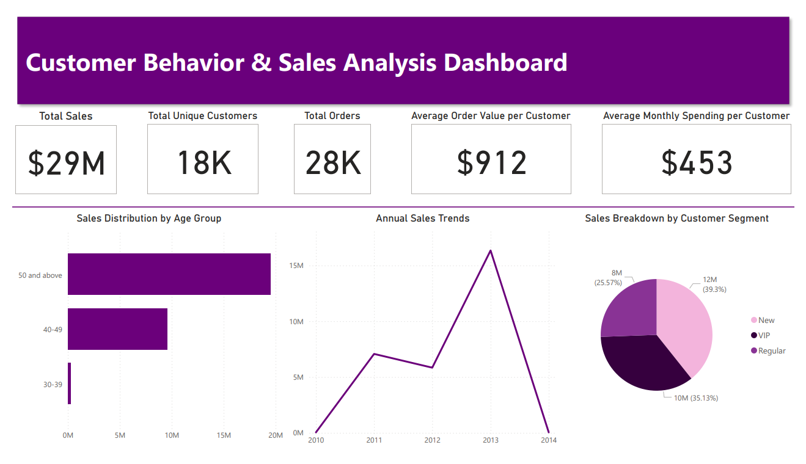

# End-to-End SQL Analytics Project

This project demonstrates a complete SQL-based analytics workflow—from database creation to advanced reporting. Designed for data analysts and BI professionals, it provides a structured, modular approach to explore, analyze, and extract actionable insights from a sales dataset. Each SQL script focuses on a specific analytical task, showcasing best practices and real-world business logic.

---

## ✅ What This Project Covers

- Database setup with star schema (dimensional modeling)

- Exploratory data analysis (EDA) across dimensions and dates

- Aggregated metrics & KPIs (sales, quantity, orders, customers)

- Time-series and cumulative trend analysis

- Performance tracking: YoY/MoM comparisons using window functions

- Customer and product segmentation

- Executive-level reporting with KPIs and dynamic views

## 📁 Project Structure

| File / View                        | Description                                                                                 |
| ---------------------------------- | ------------------------------------------------------------------------------------------- |
| `00_init_database.sql`             | Creates and loads a full analytics database with dimensional tables.                        |
| `01_database_exploration.sql`      | Explores schema, table structures, and metadata.                                            |
| `02_dimensions_exploration.sql`    | Analyzes unique values in customer and product dimensions.                                  |
| `03_date_range_exploration.sql`    | Examines time coverage and customer age distribution.                                       |
| `04_measures_exploration.sql`      | Computes high-level KPIs: total sales, orders, quantities, etc.                             |
| `05_magnitude_analysis.sql`        | Breaks down key metrics by categories like gender, country, and product.                    |
| `06_ranking_analysis.sql`          | Ranking top customers/products by sales, etc.                                               |
| `07_change_over_time_analysis.sql` | Analyzes sales and customer trends over time.                                               |
| `08_cumulative_analysis.sql`       | Builds cumulative KPIs using window functions.                                              |
| `09_performance_analysis.sql`      | Measures YoY performance and average comparisons using `LAG()` and `AVG()` windows.         |
| `10_data_segmentation.sql`         | Segments customers and products based on behavior and cost tiers.                           |
| `11_part_to_whole_analysis.sql`    | Evaluates category contributions to total sales (percent of whole).                         |
| `12_report_customers.sql`          | Creates a view summarizing customer KPIs: recency, average order value, monthly spend, etc. |
| `13_report_products.sql`           | Builds a product performance view with segmentation, AOR, and revenue metrics.              |

## 🧠 Skills Demonstrated

- SQL for data profiling and schema exploration

- Dimensional modeling (star schema: fact + dimensions)

- Aggregate & window functions (SUM(), LAG(), OVER())

- Conditional logic with CASE for segmentation

- Trend & cohort analysis

- Report generation using SQL views

## 📊 Visualizing Insights with Power BI

As a bonus to the SQL analytics, I built a Power BI dashboard to visualize key patterns in customer behavior and sales performance.

📄 [View the Dashboard (PDF)](powerbi-dashboard/End-to-End%20SQL%20Analytics%20Project%20Dashboard.pdf)

🖼️ Preview:

**Key Insights:**
- Total Sales: $29M
- Highest spending age group: 50+
- VIP customers contribute over 35% of revenue

## 🌟 About Me

This project demonstrates how data analytics can drive actionable insights in sales, customer behavior, and product performance. It showcases an end-to-end SQL workflow that can be applied to real-world business contexts, making it easier for analysts to extract valuable insights and improve business decision-making.

Let's stay in touch! Feel free to connect with me here:

### 🧰 Project Tech Stack
Microsoft SQL Server

## 🛡️ License

This project is licensed under the [MIT License](LICENSE). You are free to use, modify, and share this project with proper attribution.
